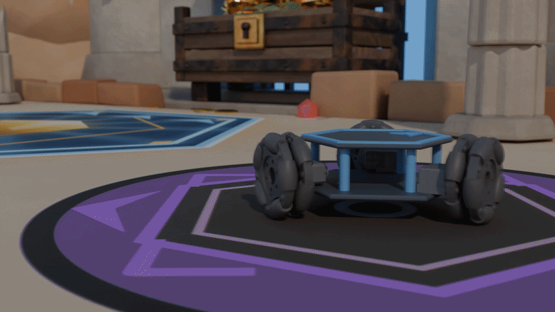
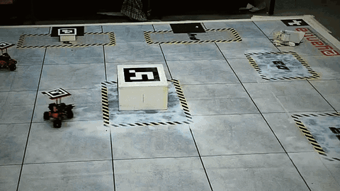

<div align="center">

# Hola The Explorer

**e-Yantra Robotics Competition 2026**


*Three robots. One buried city. A vault that only opens for a team.*

<table>
  <tr>
    <td align="center" width="50%">
      
      <br /><sub><b>Stage 1 · Simulation in MuJoCo</b></sub>
    </td>
    <td align="center" width="50%">
      
      <br /><sub><b>Stage 2 · The physical arena</b></sub>
    </td>
  </tr>
</table>

</div>

---

## The Theme

Beneath the ruins of a buried city lies a treasure no single robot can recover alone.
Three autonomous **holonomic robots** drop into the arena, sweep it for checkpoints, and
each collect a fragment of a code. No robot holds the whole thing, so the fragments have
to be relayed to a central server to decode where the relics belong. Smaller relics only
move when two robots push in sync; the largest needs all three committing at once, matched
in force and timing. Get it right and **The Lost Vault** opens.

**The four challenges**

1. Navigate three holonomic robots through the arena, avoiding obstacles and each other.
2. Discover checkpoints across the ruins and collect the code fragments.
3. Share fragments with a central server to decode the relics' destinations.
4. Coordinate the robots to collaboratively transport each relic to its destination.

---

## Stack

| Layer        | What we use                                        |
| :----------- | :------------------------------------------------- |
| Middleware   | ROS 2 Humble Hawksbill                             |
| Simulation   | MuJoCo 3.4.0                                       |
| Vision       | OpenCV                                             |
| Language     | Python 3                                           |
| Comms        | MQTT / UDP                                         |
| OS           | Ubuntu 22.04 LTS, installed natively               |

Stage 1 runs entirely in simulation; hardware arrives in Stage 2.

---

## Tasks

| Task   | Title                                          |   Marks   |
| :----: | :--------------------------------------------- | :-------: |
| **0**  | S/W Installation and Setup                     | pass/fail |
| **1A** | Checkpoint detection with image processing     |    30     |
| **1B** | Inverse kinematics of the holonomic drive      |    20     |
| **1C** | PID control: point-to-point, square, circle    |    50     |

---

## Repository

```
.
├── assets/                                  # theme media
├── bonus_task/                              # Task 0 bonus (turtlesim)
└── Software/
    └── workspace/                           # ROS 2 (colcon) workspace
        └── src/                             # the only tracked folder
            ├── hb_description/              # robot description + launch files
            ├── shape_interface/             # custom msgs / srvs
            ├── task_1a/task_1a/camera_detection.py
            ├── task_1b/task_1b/inverse_kinematics.py
            └── task_1c/task_1c/sim_control.py
```

**Build cycle (every session)**

```bash
git pull                              # from the repository root

cd Software/workspace
colcon build
source install/setup.bash
```

Pull, build, source, in that order. Every new terminal needs its own `source`.
`build/`, `install/` and `log/` are generated locally and never committed, so the build
step always has to run.

---

## Getting Help

Theme queries go to the e-Yantra discussion forum at
**[discuss.e-yantra.org](https://discuss.e-yantra.org/)**. Log in with the same e-Yantra
account used for the portal. Before posting: read the theme documents, search the web, then search existing
forum posts. Most errors have already been hit by someone. **Include the team ID in every
query** (queries without one are not addressed), describe the error in detail, and attach
screen captures rather than phone photos. Do not post anything related to the solution.

The forum is for discussion only. Every task upload happens on the
[eYRC portal](https://portal.e-yantra.org/), and only the team leader can submit.

| Resource                 | Link                                        |
| :----------------------- | :------------------------------------------ |
| Submissions & task slots | <https://portal.e-yantra.org/>              |
| Discussion forum         | <https://discuss.e-yantra.org/>             |
| ROS 2 Humble docs        | <https://docs.ros.org/en/humble/>           |
| MuJoCo docs              | <https://mujoco.readthedocs.io/en/stable/>  |

---

## Team

| Developer             |   Role    |
| :-------------------- | :-------: |
| Srivenkateshwar Iyer  | Developer |
| Bhavik Jain           | Developer |
| Sahil Shinde          | Developer |

<div align="center">

*Explore. Share. Move together.*

</div>
